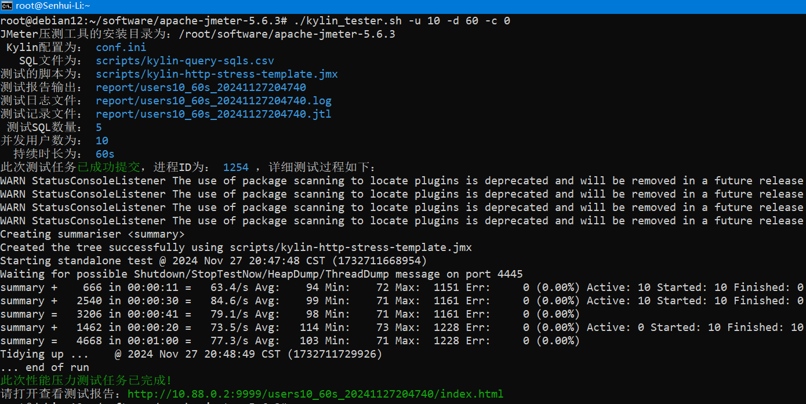
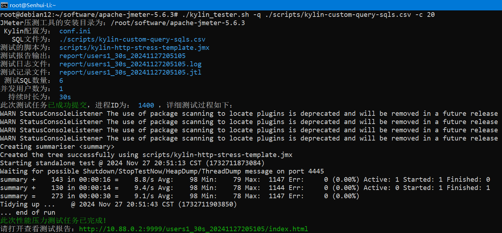
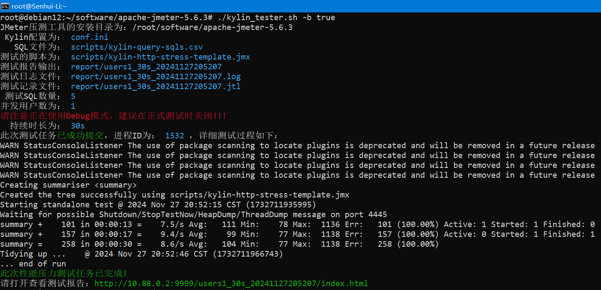
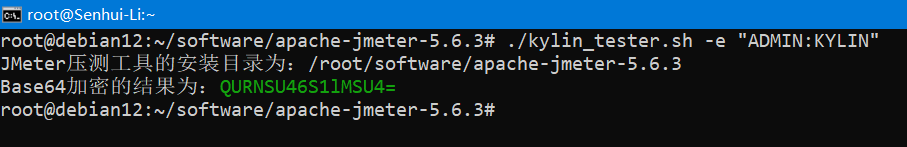
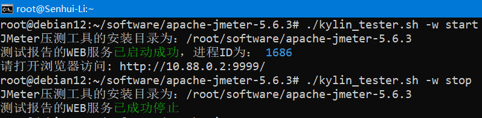

# Kylin服务JMeter压力测试模板工具

## 介绍

通常在新场景上线前都会需要对Kylin数据服务进行压力测试，以保证其服务能力和稳定性都能够达到预期要求，保障后续支撑数据应用的可靠性。为此基于 `Apache JMeter`压测软件设计一套压测的模板工具，只需要配置Kylin服务的基础参数和SQL查询语句文件，便可以快速开展性能压力测试，并得到相关的测试报告结果。

> 注：为确保测试的有效性，建议使用同一网络下的独立机器进行压测，避免因在同台机器上资源争夺而影响到测试结果。

## 目录结构

使用本模板工具前，需要先准备好标准的 `Apache JMeter`压测环境，且已经准备好Kylin服务地址、用户名、密码等参数，以及需要进行压测的SQL语句文件。然后下压本压测模板工具文件，并解压到 `Apache JMeter`的根目录下，整体的目录结构参考如下：

```shell
./apache-jmeter-5.6.3
|-- LICENSE
|-- NOTICE
|-- README.md
|-- bin
|-- conf.ini
|-- docs
|-- extras
|-- jmeter.log
|-- kylin_tester.sh
|-- lib
|-- licenses
|-- printable_docs
|-- scripts
|   |-- kylin-http-stress-template.jmx
|   `-- kylin-query-sqls.csv
`-- temp
```

上述的目录和文件中，只有 `kylin_tester.sh`、`conf.ini`和 `scripts`三部分是本压测工具的文件，其余的文件均为 `Apache JMeter`的文件，无需修改。这三部分文件的内容说明如下：

| 文件名称                               | 功能说明                                                                                                                                                                                                                                                                                     |
| -------------------------------------- | -------------------------------------------------------------------------------------------------------------------------------------------------------------------------------------------------------------------------------------------------------------------------------------------- |
| kylin_tester.sh                        | 压测主程序脚本及测试执行脚本，可灵活地按不同压测场景需求调整入参，记录测试结果                                                                                                                                                                                                               |
| conf.ini                               | 测试相关参数配置，如Kylin服务地址，端口，用户密码，项目等                                                                                                                                                                                                                                    |
| scripts/kylin-http-stress-template.jmx | JMeter测试脚本，用于记录Kylin参数，测试内容，报告形式等基础配置信息                                                                                                                                                                                                                          |
| scripts/kylin-query-sqls.csv           | 测试SQL的CSV文件，需要使用UTF8格式编码，建议使用Unix格式保存，文件内容主要包含有如下3个列（请保留表头）：1.query_no：测试SQL语句的序号，便于排查问题和统计分析 2.is_complex：是否复杂SQL，可选值：y和n，用来规避复杂查询影响 3.query_sql：具体的查询SQL语句，使用双引号包围住 |

## 参数说明

`kylin_tester.sh` 脚本中共设计有12项参数，可根据实际情况进行调整，具体的参数说明如下：

```shell
./kylin_tester.sh -h
JMeter压测工具的安装目录为：/root/software/apache-jmeter-5.6.3
示例: kylin_tester.sh <命令>
命令:
  -i   KYLIN配置参数文件的相对路径，默认为：conf.ini
  -q   KYLIN查询SQL文件的相对路径，默认为：scripts/kylin-query-sqls.csv
  -j   JMeter测试脚本的相对路径，默认为：scripts/kylin-http-stress-template.jmx
  -o   测试结果输出名称，包括日志名称，脚本记录，HTML报告
  -u   并发测试用户数，默认为：1
  -l   测试轮循次数，默认为-1，表示使用持续时间方式
  -r   并发测试用户唤起时间，单位：秒，默认为5秒
  -d   并发测试的持续时间，单位：秒，默认为30秒
  -c   复杂SQL执行比例（0-100），默认为100
  -b   是否开启Debug模式，默认为false
  -e   用Base64加密认证信息，用:号隔开用户与密码
  -w   启停简易WEB服务，可选操作：start|stop
```

如没有其他需求的话，可直接执行`./kylin_tester.sh`开始压测，默认会使用1个并发用户，持续时间30秒进行性能压力测试，另外上述的参数也可以直接在`config.ini`文件中进行配置。

## 命令参考

- **场景1：** 并发10个用户，持续1分钟，不使用复杂SQL

```shell
./kylin_tester.sh -u 10 -d 60 -c 0
```



- **场景2：** 自定义SQL语句，复杂SQL比例20%

```shell
./kylin_tester.sh -q ./scripts/kylin-custom-query-sqls.csv -c 20
```



- **场景3：** 开启Debug模式

```shell
./kylin_tester.sh -b true
```



> 注：此模式只支持Kylin5.0+或是企业版本，建议在调试阶段开启Debug模式，通过Kylin查询响应的`code`信息判断是否有正确响应查询请求。

- **场景4：** 加密认证信息

```shell
./kylin_tester.sh -e "ADMIN:KYLIN"
```



## 报告信息

性能压力测试执行完成后，会自动生成HTML报告文件（访问地址信息会直接打印在终端上显示出来）和过程记录信息，默认都是存放在`Apache JMeter`根目录中的`report`目录里面，命名格式和规范参考如下：

```shell
# 命名格式是以users开头+用户数+执行时间+时间戳

apache-jmeter-5.6.3/report/
|-- users1_10s_20241126195157      #HTML报告文件 
|-- users1_10s_20241126195157.jtl  #JMeter监听器记录文件
`-- users1_10s_20241126195157.log  #日志文件
```

```shell
./kylin_tester.sh -w start
```



> 注：做完压测或是查看好报告后，千切要记得关闭简易WEB服务。

